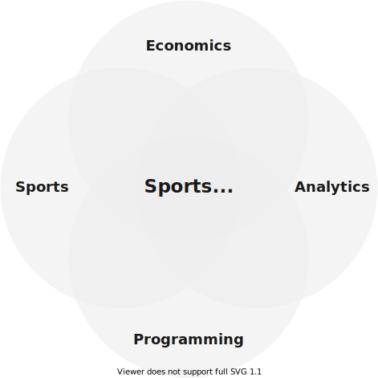

- This day and before
- Initial Proposal
	- 
	- ## Student Details
		- Ahmed Thahir
		- 2020A7PS0198U
	- ## Topic
		- Sports Data Analytics and Performance Prediction
	- ## Objectives
		- The project will involve researching how to
			- Analyze sports data
			- Obtain useful insights from data
			- Identify the quality of a player/team and find undervalued players
			- Predict player/team performance, by using Machine Learning techniques on sports datasets
			- Optimize player/team training, recovery, and performance using above the concepts
	- ## Reason
		- The following are the reasons for choosing this topic
			- Intersection of multiple interests of mine
				- {:height 200, :width 200}
				- Programming
				- Analytics
				- Sports
			- Application-based approach to Machine Learning
			- Data analytics (especially for Sports) is a rapidly-growing field
			- There is vast potential in Sports Analytics
				- Large number of clubs are now trying to optimize using data, instead of just using old-fashioned intuition
				- Coaches can now eliminate ‘guessing’ and use algorithms to help make otherwise complex decisions
	- # Methodology
	  
	  1. Gather data from sports databases and other sources
	  2. Read and summarize recent journals, reports and conference papers
	  3. Find and implement algorithm(s) that have been used for analysis in the above research
	  4. Use Python for the implementation, as it is open source
	  5. Test the implementation against real dataset(s)
- 