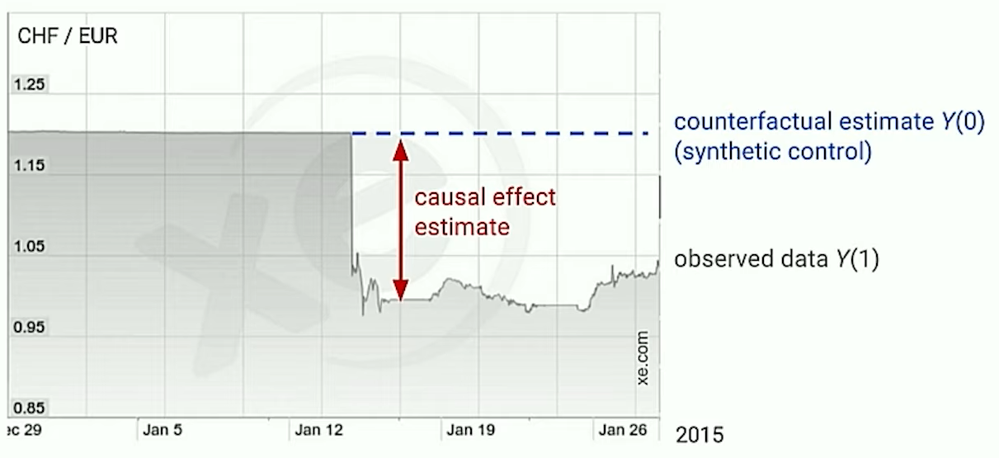

- Deals with understanding the impact of action on the output
- # Visualization
	- when you highlight causal inference on a [[Time Series]] chart, it should be vertical lines
	- 
- # Libraries
	- query-properties:: [:page :tags :company]
	  #+BEGIN_QUERY
	  {
	  :query ( and (page-tags Library) (page-tags Causality) )
	  }
	  #+END_QUERY