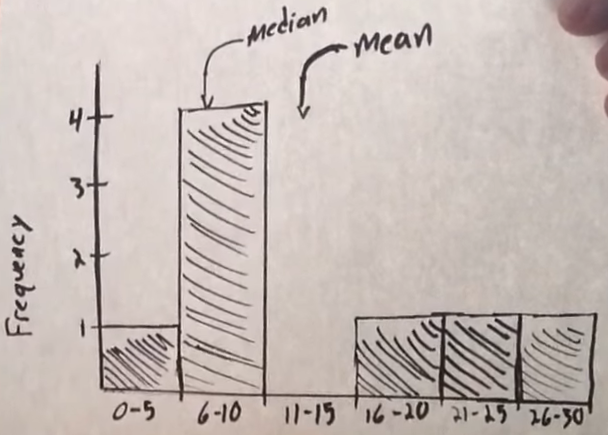

- Measures
	- Mean
	- Median
	- Mode
- Mean vs Median
	- Median is preferred for asymmetric data which is heavily skewed
		- as it is possible that mean will point to a data point that doesn't even exist
		- {:height 361, :width 747}