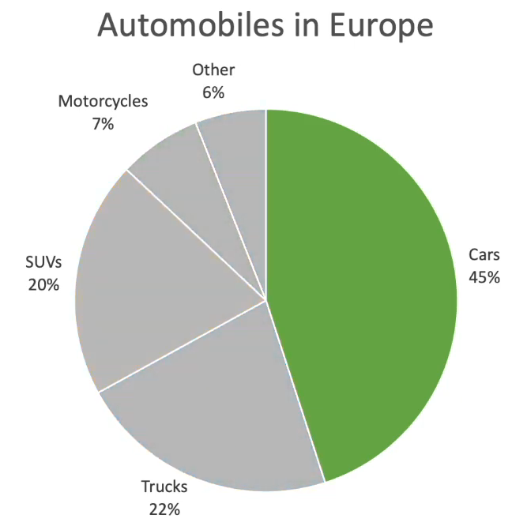
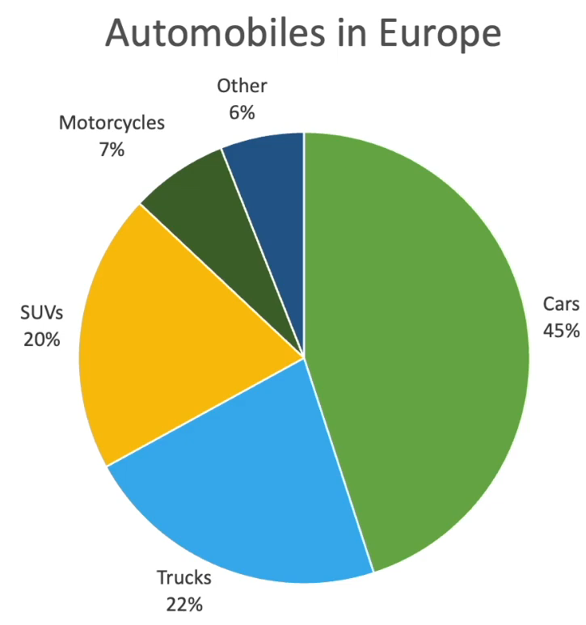

alias:: Graphs

- # Pie Chart
	- ||Good|Bad|
	  |--|--|--|
	  |Showing|only single category relative to the whole|multiple categorical data|
	  |Example|||
	  |Solution||  Use **sorted** bar chart instead|
	- Try to avoid, but if you have to use
		- Make sure sum(categories)=100
		- Categories should be sorted
		- Concise labels
		- $\le 5$ categories
			- If there are more, make it 'others'
		- Do not compare pie-charts side by side