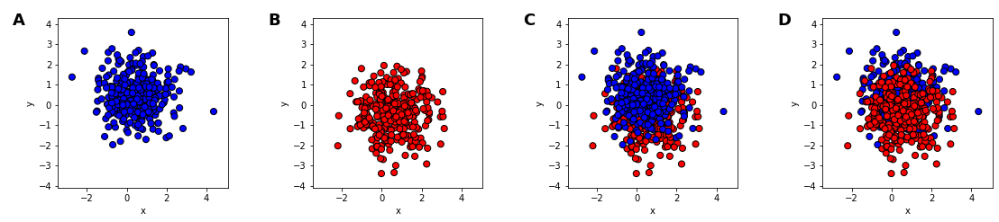
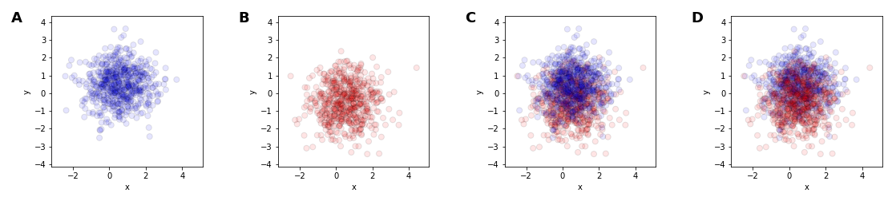
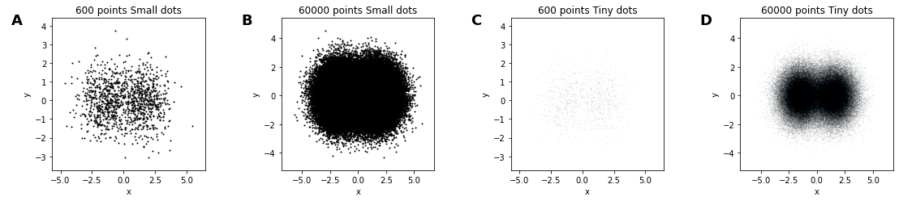
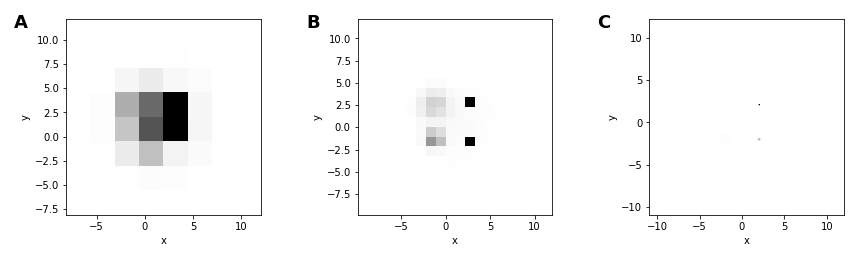
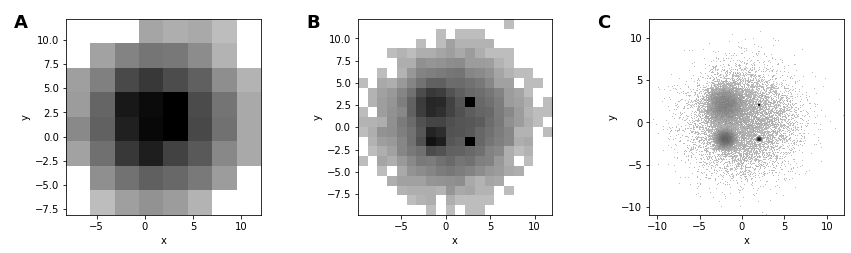
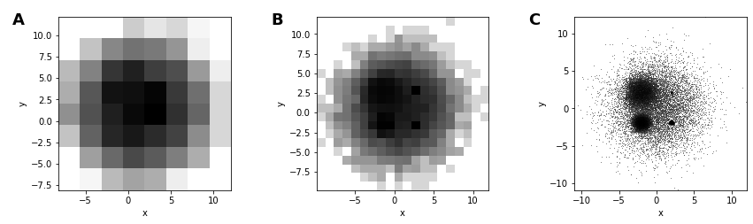
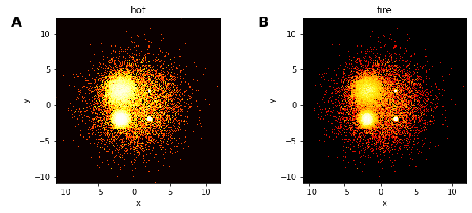

tags:: [[Python]] [[Plotly]] [[Library]] [[Data Visualization]]

- Useful for large data visualization
- `pip install datashader`
- # Theory
  collapsed:: true
	- ## Problems
	  collapsed:: true
		- |         Pitfall         |                           Meaning                            |                           Concern                            |                      Example                      |
		  | :---------------------: | :----------------------------------------------------------: | :----------------------------------------------------------: | :-----------------------------------------------: |
		  |      Overplotting       |                Datapoint/curve covers another                | Plots C and D shown the same distribution of points, yet they give a very different impression of which category is more common |  |
		  |     Oversaturation      | Overplotting even after reducing transparency due to too many points |                              ^                               |  |
		  |      Undersampling      |            Small sample of large dataset is taken            |    Shape can be very difficult or impossible to interpret    |  |
		  |     Undersaturation     | data points spread over many different heatmap bins/nearly transparent scatter points |      large number of data points can be missed entirely      |  |
		  |   Underutilized range   | all/nearly all pixels are mapped into either bottom end of the visible range (light gray), or the top end (black, used only for the single pixel holding the “very narrow spread” distribution). |       differences in datapoint density are not visible       |  |
		  | Nonuniform colormapping | most of the colormaps in common use in plotting programs are highly *non*uniform | large range of data values will all appear in shades that are perceptually indistinguishable |  |
	- ## Solution
	  collapsed:: true
		- ✅ 2D heatmap with good binning grid size, offset, and heatmap equalization
		  collapsed:: true
			- 
			- Solves
				- **overplotting** (since multiple data points sum arithmetically into the grid cell, without obscuring one another)
				- **oversaturation** (because the minimum and maximum counts observed can automatically be mapped to the two ends of a visible color range),
				- **undersampling** (since the resulting plot size is independent of the number of data points, allowing it to use an unbounded amount of incoming data).
				- **undersaturation**, since all pixels are either clearly zero (in the background color, i.e. white in this case), or a non-background color taken from the colormap.
				- **Underutilized range**, since we can now see the full structure of the dataset, with all five Gaussians clearly visible in B and C, and the relative spreads also clearly visible in C.
			- Choice of transformation
				- We can approximate such a rank-order or percentile encoding using the histogram equalization function from an image-processing package, which makes sure that each gray level is used for about the same number of pixels in the plot
				- ```python
				  from skimage.exposure import equalize_hist
				  eq_hist = lambda d,m: equalize_hist(1000*d,nbins=100000,mask=m)
				  
				  hv.Layout([heatmap(dist,bins,transform=eq_hist) for bins in [8,20,200]])
				  ```
		- Uniform color equivalents
			- [[Matplotlib]] - viridis, plasma, inferno, or magma
			  or `colorcet` package
			- 
		- ❌ Reducing transparency of datapoint/curve
		- ❌ Reducing point/curve size (points hard to see)
- # Usage
  collapsed:: true
	- Regular
		- ```python
		  import xarray as xr
		  import datashader as ds
		  import datashader.transfer_functions as tf
		  
		  x = np.arange(1_000_000)
		  y = np.sin(x)
		  df = pd.concat([pd.Series(x), pd.Series(y)], axis=1)
		  df.columns=["x", "y"]
		  df
		  
		  cvs = ds.Canvas(plot_height=900, plot_width=1600)
		  aggs = cvs.line(df, x="x",  y="y")
		  img = tf.shade(aggs)
		  
		  img
		  ```
	- with [[Plotly]]
		- ```python
		  import plotly.express as px
		  import pandas as pd
		  import numpy as np
		  import datashader as ds
		  df = pd.read_parquet('https://raw.githubusercontent.com/plotly/datasets/master/2015_flights.parquet')
		  
		  cvs = ds.Canvas(plot_width=100, plot_height=100)
		  agg = cvs.points(df, 'SCHEDULED_DEPARTURE', 'DEPARTURE_DELAY')
		  zero_mask = agg.values == 0
		  agg.values = np.log10(agg.values, where=np.logical_not(zero_mask))
		  agg.values[zero_mask] = np.nan
		  fig = px.imshow(agg, origin='lower', labels={'color':'Log10(count)'})
		  fig.update_traces(hoverongaps=False)
		  fig.update_layout(coloraxis_colorbar=dict(title='Count', tickprefix='1.e'))
		  fig.show()
		  ```