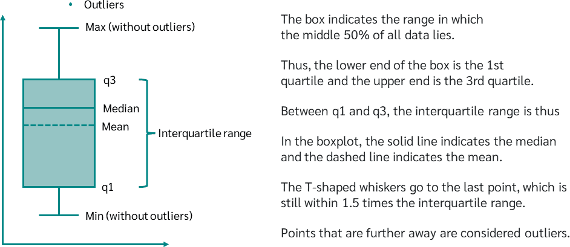

alias:: EDA
tags:: [[Pandas]]

- 
- # Step 0: Imports and Reading Data
  collapsed:: true
	- ((62cac844-e087-4d20-92b6-9521d2aecfcb))
	- ((62c96ceb-dcf0-4f9a-8c26-d622a1cd9c18))
	- ((62c96cea-3de8-4027-b4fe-be20612e3204))
	- ((62c96cea-9db2-4c4b-b647-dba8aefef663))
	- ((62cace5f-7923-4c60-82f0-7a87a4e67c1c))
	- ```python
	  df = pd.read_csv('../input/rollercoaster-database/coaster_db.csv')
	  ```
- # Step 1: Data Understanding
  collapsed:: true
	- ```python
	  df.shape
	  df.head(5), df.tail(5)
	  df.columns
	  df.dtypes
	  df.describe()
	  ```
- # Step 2: Data Preperation
  collapsed:: true
	- ## Dropping columns and rows
	  collapsed:: true
		- ```python
		  # Example of dropping columns
		  # df.drop(['Opening date'], axis=1)
		  
		  df = df[['coaster_name',
		           # ...
		           'height_ft',
		          ]].copy()
		  ```
	- ## Setting Datatype
	  collapsed:: true
		- ```python
		  df['opening_date_clean'] = pd.to_datetime(df['opening_date_clean'])
		  ```
	- ## Renaming Columns
	  collapsed:: true
		- ```python
		  df = df.rename(columns={
		    'coaster_name':'Coaster_Name',
		    'year_introduced':'Year_Introduced',
		    'Gforce_clean':'Gforce'
		  })
		  ```
	- ## Nulls
	  collapsed:: true
		- ```python
		  df.isna().sum()
		  ```
	- ## Duplicates
	  collapsed:: true
		- ```python
		  df.loc[df.duplicated()]
		  df.loc[df.duplicated(subset=['Coaster_Name'])].head(5)
		  
		  # drop all the rows where the coastername, location, openingdate are duplicated
		  df = (
		    df
		    .loc[
		    		~df.duplicated(subset=['Coaster_Name','Location','Opening_Date'])
		    ]
		    .reset_index(drop=True)
		    .copy()
		  ```
- # Step 3: Feature Understanding (Univariate analysis)
  collapsed:: true
	- ```python
	  df['Year_Introduced'].value_counts()
	  df['Type_Main'].value_counts()
	  ```
	- ## Bar Graph
	  collapsed:: true
		- ```python
		  ax = df['Year_Introduced'].value_counts() \
		      .head(10) \
		      .plot(
		    			kind='bar', # barh for horizontal
		    			title='Top 10 Years Coasters Introduced')
		  ax.set_xlabel('Year Introduced')
		  ax.set_ylabel('Count')
		  ```
	- ## Histogram
	  collapsed:: true
		- ```python
		  ax = df['Speed_mph'].plot(kind='hist',
		                            bins=20,
		                            title='Coaster Speed (mph)')
		  ax.set_xlabel('Speed (mph)')
		  ```
	- ## KDE
	  collapsed:: true
		- ```python
		  ax = df['Speed_mph'].plot(kind='kde',
		                            title='Coaster Speed (mph)')
		  ax.set_xlabel('Speed (mph)')
		  ```
	- ## Distribution Plot
		- ```python
		  sns.distplot(
		    student["score"],
		    bins = 20
		  )
		  ```
	- ## Box Plot
	  collapsed:: true
		- ```python
		  sns.boxplot(
		    x = "diagnosis",
		    y = "area_mean",
		    data = df
		  )
		  ```
		- {:height 303, :width 858}
- # Step 4: Feature Relationships (Bivariate Analysis)
  collapsed:: true
	- ## Scatterplot
	  collapsed:: true
		- ```python
		  df.plot(kind='scatter',
		          x='Speed_mph',
		          y='Height_ft',
		          title='Coaster Speed vs. Height')
		  plt.show()
		  
		  ax = sns.scatterplot(x='Speed_mph',
		                  y='Height_ft',
		                  hue='Year_Introduced',
		                  data=df)
		  ax.set_title('Coaster Speed vs. Height')
		  plt.show()
		  ```
	- ## Regplot
	  collapsed:: true
		- ```python
		  sns.regplot(
		    x='AST',
		    y='FGM',
		    data=NBA_Games,
		    marker='.')
		  ```
		- Shows scatter plot as well as regression line
	- ## Pairplot
	  collapsed:: true
		- ```python
		  sns.pairplot(df,
		               vars=['Year_Introduced','Speed_mph',
		                     'Height_ft','Inversions','Gforce'],
		              hue='Type_Main')
		  plt.show()
		  ```
	- ## Line Plot #[[Time Series]]
		- ```python
		  cols = ["Consumption", "Solar", "Wind"]
		  axes = (
		    opsd_daily
		    [cols]
		    .plot(
		      marker = '.',
		      alpha = 0.5,
		      linestyle = "No??"
		    )
		  )
		  
		  for ax in axes:
		    ax.set_ylabel("Daily Totals (GWh)")
		  ```
	- ## Autocorrelation Plot #[[Time Series]]
	  collapsed:: true
		- ```python
		  from pandas.plotting import autocorrelation_plot as autoplot
		  autoplot(ospd_daily["Consumption"])
		  ```
	- ## Lag Plot #[[Time Series]]
	  collapsed:: true
		- ```python
		  from pandas.plotting import lag_plot as lagplot
		  lagplot(
		    data["Consumption"],
		    c = data["Is_Weekend"][:-1]
		  )
		  ```
	- ## Correlation Heatmap
	  collapsed:: true
		- ```python
		  df_corr = df[['Year_Introduced','Speed_mph',
		      'Height_ft','Inversions','Gforce']].dropna().corr()
		  
		  sns.heatmap(df_corr, annot=True)
		  ```
	- ## Groupby Comparison
	  collapsed:: true
		- ```python
		  ax = df.query('Location != "Other"') \
		      .groupby('Location')['Speed_mph'] \
		      .agg(['mean','count']) \
		      .query('count >= 10') \
		      .sort_values('mean')['mean'] \
		      .plot(
		    		kind='barh',
		    		figsize=(12, 5),
		    		title='Average Coast Speed by Location'
		  	)
		  ax.set_xlabel('Average Coaster Speed')
		  plt.show()
		  ```