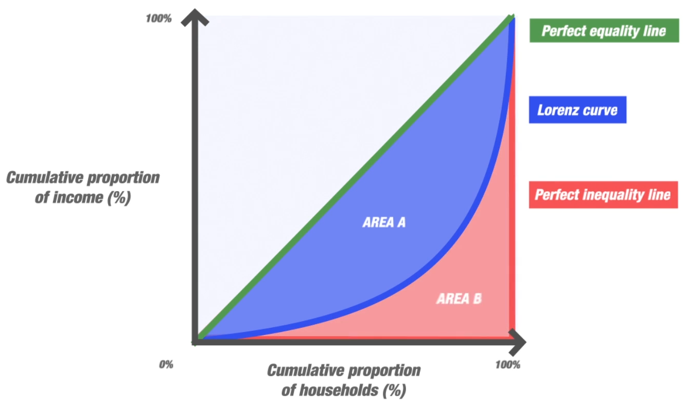

- # Aim
	- Quantifies disparities/inequality in a distribution
	- mainly used for income disparities
- # Intuition
	- 
	- $$
	  \text{GC} = \frac{
	  \text{Area A}
	  }{
	  \text{Area A+Area B}
	  }
	  $$
	- varies from $[0, 1]$
		- 0 means perfect equality
		- 1 means perfect inequality
- # Math
	- $$
	  \begin{aligned}
	  G
	  &=\frac{2}{n^{2} \bar{x}} \sum\limits_{i=1}^{n} i\left(x_{i}-\bar{x}\right) \\
	  &=\frac{\sum\limits_{i=1}^{n}(2 i-n-1) x_{i}}{n \sum\limits_{i=1}^{n} x_{i}}
	  \end{aligned}
	  $$
- # Implementation
	- ## Gini-Coefficient
		- ```python
		  def gini(df, col):
		      """Calculate the Gini coefficient of a numpy array."""
		      array = np.array(df[col])
		      
		      array = array.flatten()
		      if np.amin(array) < 0:
		          # Values cannot be negative:
		          array -= np.amin(array)
		      # Values cannot be 0:
		      array += 0.0000001
		      # Values must be sorted:
		      array = np.sort(array)
		      # Index per array element:
		      index = np.arange(1,array.shape[0]+1)
		      # Number of array elements:
		      n = array.shape[0]
		      # Gini coefficient:
		      giniCoefficient = ((np.sum((2 * index - n  - 1) * array)) / (n * np.sum(array)))
		      
		      # these are my tweaks
		      fixed = abs(round(giniCoefficient, 4))
		      return fixed
		  ```
	- ## Histogram
		- ```python
		  def histogram(df, col):
		      plt.hist(df[col], edgecolor="white", alpha = 0.8)
		      plt.title("Histogram for " + col)
		      plt.xlabel(col), plt.ylabel("Frequency")
		      plt.show()
		  ```
	- ## Lorentz Curve
		- ```python
		  def lorentz(df, col):
		      # this divides the prefix sum by the total sum
		      # this ensures all the values are between 0 and 1.0
		      arr = np.sort(df[col])
		      scaled_prefix_sum = arr.cumsum() / arr.sum()
		      
		      y = np.insert(scaled_prefix_sum, 0, 0) # this prepends the 0 value (because 0% of all people have 0% of all wealth)
		      x = np.linspace(0.0, 1.0, y.size) # we need the X values to be between 0.0 to 1.0
		  
		      #     plt.plot(x, x, "--o", color="green", alpha=0.8)
		      plt.plot(x, y, "--", alpha=0.8)
		  
		      plt.fill_between(x, x, color="red", alpha=0.2)
		  
		      plt.fill_between(x, y, color="white")
		      plt.fill_between(x, y, color="green", alpha = 0.2)
		  
		      plt.title("Lorentz Curve for " + col)
		      plt.show()
		  ```
	- ## Calling
		- ```python
		  def giniAnalysis(df, col):
		      print(
		          "The gini coefficent was found to be " + str( gini(df, col) )
		      )
		      histogram(df, col)
		      lorentz(df, col)
		  ```
- # Limitations
	- It is possible for the Gini coefficient of a developing country to rise (due to increasing inequality of income) while the number of people in absolute poverty decreases.
		- This is because the Gini coefficient measures relative, not absolute, wealth.