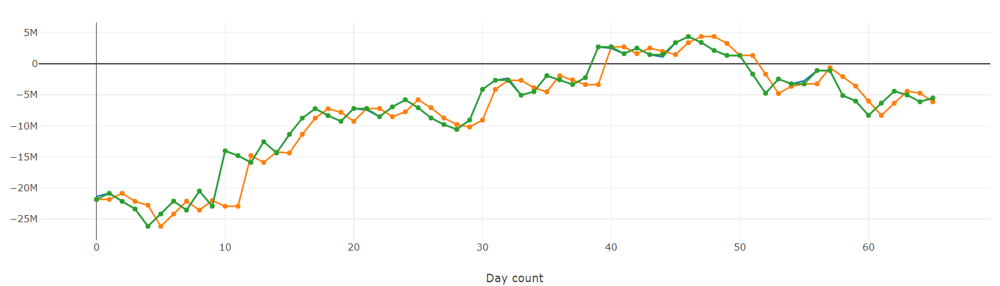

tags:: #Prediction #Causality #[[Time Series]]

- # Aim
	- to check if one timeseries data affects another
	- if the current value of $y$ is affected by previous time period's $x$
	- in this example, orange **granger causes** green
		- 
- # Intuition
	- $y_t = a + b y_{t-1} + c x_{t-1}$
	- If $c \ne 0$, then $x$ **granger causes** $y$
	- $t$ and $t-1$ are not necessarily years; it just denotes a time period
- # Math
	- Grange causality means that past values of $x$ have a statistically significant effect on the current value of $y$, taking past values of $x$ as regressors.
	- The Null hypothesis for Granger Causality Tests is that the time series in the second column, $x$, does NOT Granger cause the time series in the first column, $y$. We reject the null hypothesis that $x$ does not Granger cause $y$ if the [[p-value]]s are below a desired size of the test.
	- The null hypothesis for all four test is that the coefficients corresponding to past values of the second time series are zero.
		- `params_ftest` and `ssr_ftest` are based on F distribution
		- `ssr_chi2test` and `lrtest` are based on chi-square distribution
	- ## Steps
		- Find the time periods where the lagged $y$ are significant
			- $y_t = a_0 + a_1 y_{t-1} + a_2 y_{t-2} + \dots + a_k y_{t-k}$
		- Build the granger's equation with those time periods
			- $y_t = a_0 + a_1 y_{t-1} + a_2 y_{t-2} + \dots + a_k y_{t-k} + b_1 x_{t-1} + b_2 x_{t-2} + \dots + b_k x_{t-k}$
		- Hypothesis testing using $t$ test
			- $H_0: b_1 = b_2 = \dots = b_k = 0$
			- $H_1:$ Atleast one of them is non-zero
			- If $p$ value $< 0.05$
				- reject $H_0$
				- accept $H_1$
		- Testing using $F$ test
			- Checks if all these lags are significant
			- I didn't quite understand this
- # Implementation
	- ```python
	  from statsmodels.tsa.stattools import grangercausalitytests
	  ```
	- ```python
	  df = pd.DataFrame(columns=['y', 'x'])
	  lag = 3
	  ```
	- ```python
	  display( grangercausalitytests(df, lag) )
	  ```
- # Limitations
	- ==not necessarily true causality==
	- we may not be able to find granger causality if
		- $x$ affects $y$ through $z$
		- ie $y = f(z); z = g(x) \implies y = f \circ g(x)$