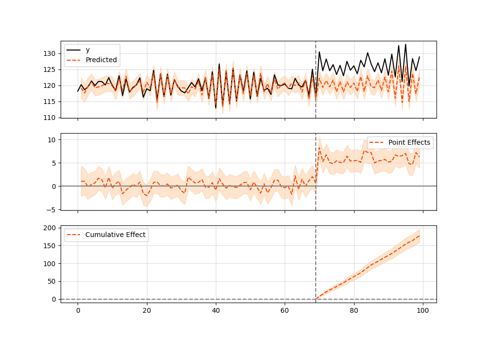

tags:: [[Python]] [[Causality]] [[Library]]

- ```
  pip install tfcausalimpact
  ```
- ```python
  import pandas as pd
  from causalimpact import CausalImpact
  
  data = pd.read_csv('https://raw.githubusercontent.com/WillianFuks/tfcausalimpact/master/tests/fixtures/arma_data.csv')[['y', 'X']]
  data.iloc[70:, 0] += 5
  
  pre_period = [0, 69]
  post_period = [70, 99]
  
  ci = CausalImpact(data, pre_period, post_period)
  print(ci.summary())
  print(ci.summary(output='report'))
  ci.plot()
  ```
- ## Output
	- ```
	  Posterior Inference {Causal Impact}
	                            Average            Cumulative
	  Actual                    125.23             3756.86
	  Prediction (s.d.)         120.34 (0.31)      3610.28 (9.28)
	  95% CI                    [119.76, 120.97]   [3592.67, 3629.06]
	  
	  Absolute effect (s.d.)    4.89 (0.31)        146.58 (9.28)
	  95% CI                    [4.26, 5.47]       [127.8, 164.19]
	  
	  Relative effect (s.d.)    4.06% (0.26%)      4.06% (0.26%)
	  95% CI                    [3.54%, 4.55%]     [3.54%, 4.55%]
	  
	  Posterior tail-area probability p: 0.0
	  Posterior prob. of a causal effect: 100.0%
	  
	  For more details run the command: print(impact.summary('report'))
	  ```
	- {:height 361, :width 716}